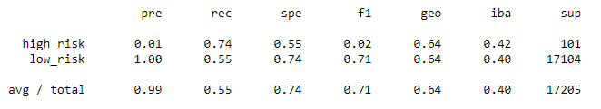
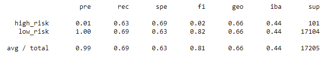
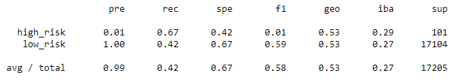
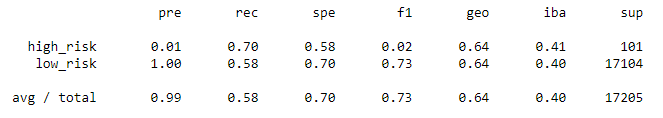
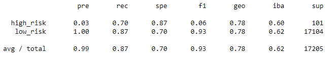
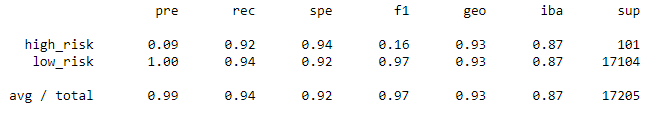

# Credit Risk Analysis
## Overview
The purpose of this analysis was to use different techneques to train and evaluate models with unbalanced classes.

## Results
### Native Oversampling
  
precision: 0.01  
recall: 0.74  
f1: 0.02  

### SMOTE Oversampling
  
precision: 0.01  
recall: 0.63  
f1: 0.02  

### Undersampling
  
precision: 0.01  
recall: 0.67  
f1: 0.01  

### Combination Sampling
  
precision: 0.01  
recall: 0.70  
f1: 0.02  

### Balanced Random Forest Classifier
  
precision: 0.01  
recall: 0.70  
f1: 0.06  

### Easy Ensemble AdaBoost Classifier
  
precision: 0.09  
recall: 0.92  
f1: 0.16  

## Summary
None of the models yeild acceptable precision or accuracy in predicting high risk loans.
